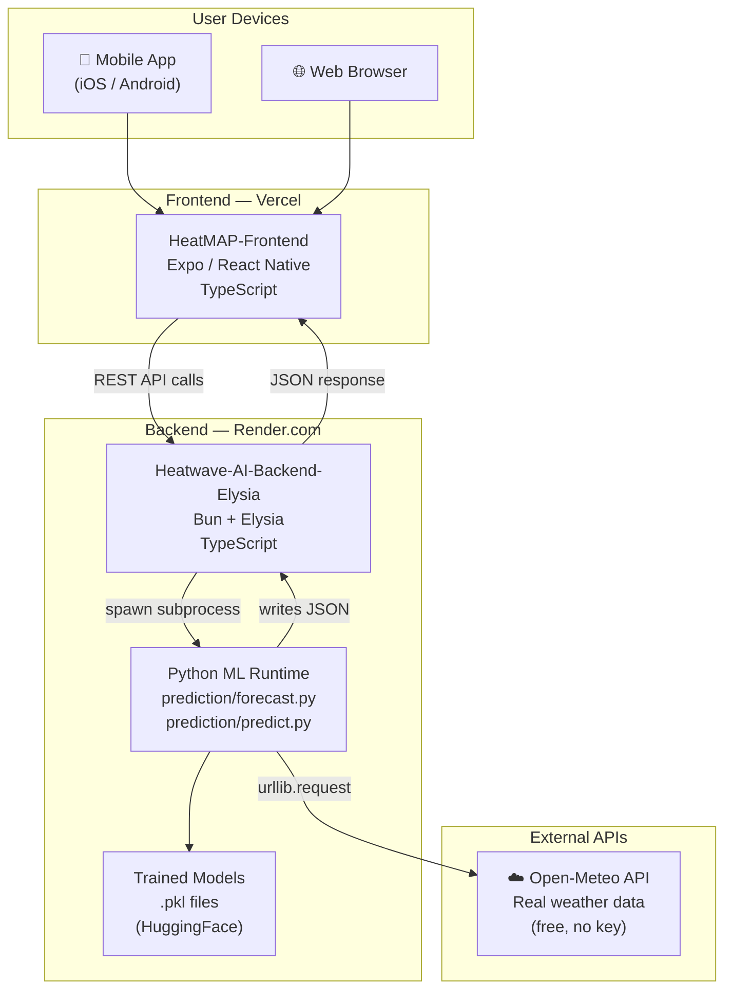
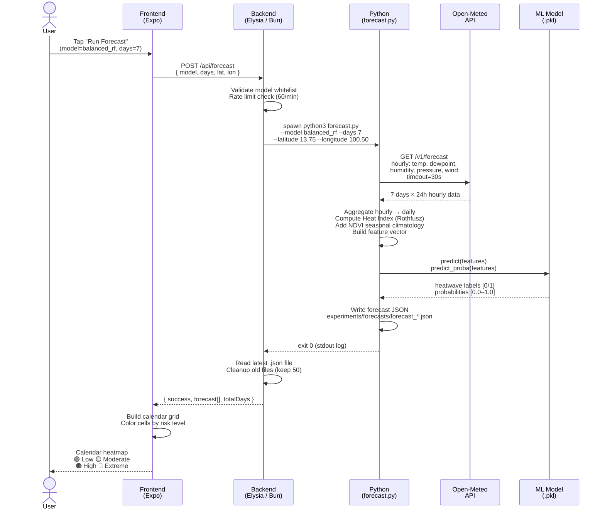
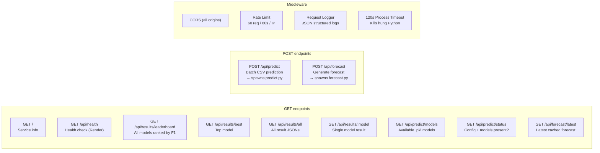
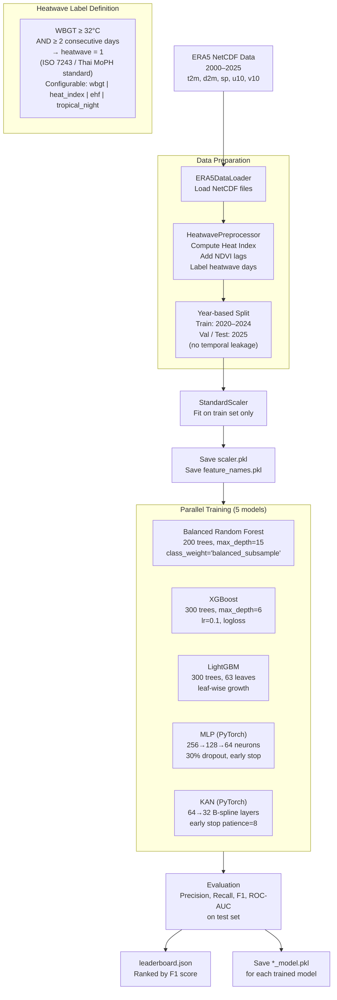
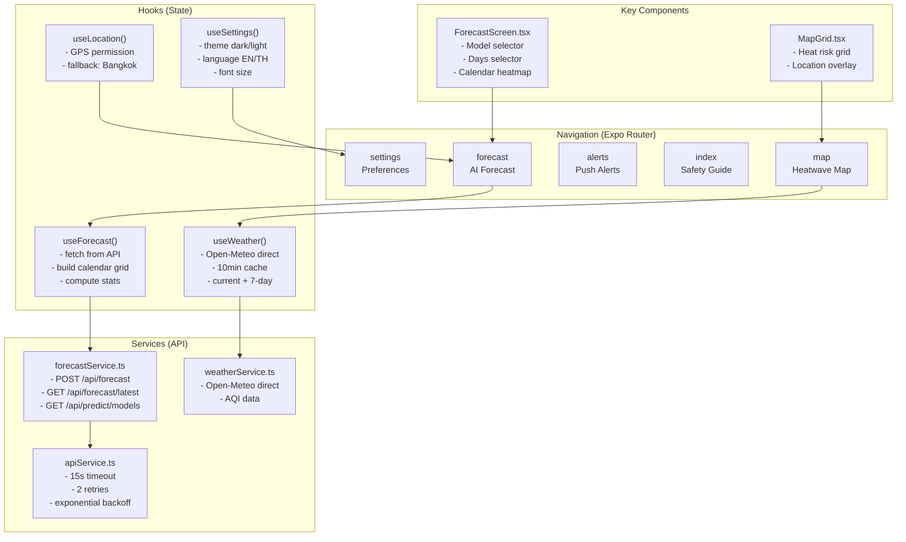
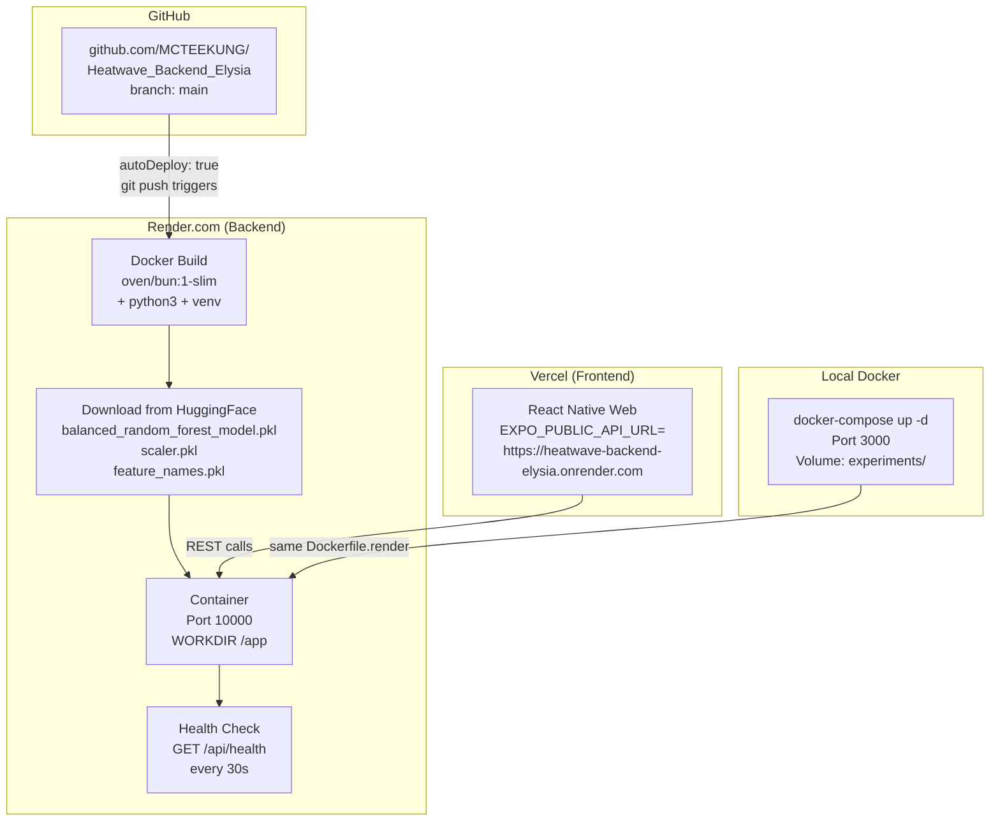

# Heatwave-AI — Architecture & System Overview

> A full-stack AI system for heatwave prediction in Thailand.
> Built with React Native (frontend), Bun + Elysia (backend), and Python ML (inference).

---

## Table of Contents
1. [System Overview](#1-system-overview)
2. [Repository Structure](#2-repository-structure)
3. [Data Flow — Forecast Request](#3-data-flow--forecast-request)
4. [Backend API Map](#4-backend-api-map)
5. [ML Pipeline — Training](#5-ml-pipeline--training)
6. [ML Pipeline — Inference (Forecast)](#6-ml-pipeline--inference-forecast)
7. [Frontend Architecture](#7-frontend-architecture)
8. [Deployment Architecture](#8-deployment-architecture)
9. [Environment Variables & Config](#9-environment-variables--config)
10. [Risk Level Thresholds](#10-risk-level-thresholds)

---

## 1. System Overview



---

## 2. Repository Structure

```
Heatwave-AI/                          ← Monorepo root
│
├── HeatMAP-Frontend/                 ← React Native / Expo app
│   ├── app/
│   │   ├── (tabs)/                   ← 5 main screens (tabs)
│   │   │   ├── map.tsx               ← Heatwave map view
│   │   │   ├── forecast.tsx          ← 30-day AI forecast
│   │   │   ├── alerts.tsx            ← Push alerts
│   │   │   ├── index.tsx             ← Safety guidelines
│   │   │   └── settings.tsx          ← App settings
│   │   └── _layout.tsx               ← Root layout + providers
│   ├── components/
│   │   ├── forecast/ForecastScreen.tsx  ← Forecast calendar UI
│   │   └── map/MapGrid.tsx           ← Map heat grid
│   ├── hooks/
│   │   ├── useForecast.ts            ← Forecast state + calendar logic
│   │   └── useWeather.ts             ← Open-Meteo current weather
│   └── services/
│       ├── apiService.ts             ← Base HTTP client (retry, timeout)
│       └── forecastService.ts        ← Forecast API calls
│
├── Heatwave-AI-Backend-Elysia/       ← API server
│   ├── src/index.ts                  ← All 11 endpoints
│   ├── prediction/
│   │   ├── forecast.py               ← Open-Meteo fetch → ML inference
│   │   ├── predict.py                ← Batch CSV prediction
│   │   └── predictor.py              ← Model loader class
│   ├── models/                       ← Downloaded .pkl files
│   ├── experiments/
│   │   ├── results/                  ← Model evaluation JSON
│   │   └── forecasts/                ← Generated forecast JSON/CSV
│   ├── config.yaml                   ← Model hyperparams + thresholds
│   ├── requirements.txt              ← Python dependencies
│   ├── Dockerfile.render             ← Docker build (Bun + Python3)
│   └── package.json
│
├── Heatwave-AI-TRAIN/                ← ML training pipeline
│   ├── pipelines/training_pipeline.py
│   ├── models/                       ← Model class implementations
│   ├── training/                     ← Trainer, cross-val, HPO
│   ├── evaluation/                   ← Metrics, leaderboard
│   ├── utils/                        ← Data loader, preprocessing
│   └── main.py                       ← CLI entry point
│
├── Era5-data-2000-2026/              ← ERA5 NetCDF climate data
├── ndvi/                             ← NDVI vegetation index data
├── render.yaml                       ← Render.com service config
├── docker-compose.yml                ← Local Docker dev setup
└── ARCHITECTURE.md                   ← This file
```

---

## 3. Data Flow — Forecast Request



---

## 4. Backend API Map



**Rate limiting:** 60 requests per IP per minute (in-memory, resets on restart).

---

## 5. ML Pipeline — Training



**Heatwave label (default):** WBGT ≥ 32 °C for ≥ 2 consecutive days = `heatwave = 1`.
WBGT (Wet-Bulb Globe Temperature) is used because Thailand's hot-humid climate makes
pure temperature thresholds insufficient — sweat evaporates poorly at high RH. The 32 °C
threshold matches Thailand's MoPH public-advisory level. Formula: ABoM outdoor approximation
(Lemke & Kjellstrom 2012): `WBGT = 0.567·T + 0.393·e + 3.94` where `e` is vapor pressure.

**Data split:** 2000–2019 used as climatology baseline (percentile labels only),
2020–2024 as training data, 2025 as the held-out validation year.

---

## 6. ML Pipeline — Inference (Forecast)

```mermaid
flowchart LR
    subgraph INPUT["Inputs"]
        A1["--model balanced_rf"]
        A2["--days 7"]
        A3["--latitude 13.75\n--longitude 100.50"]
        A4["--config config.yaml"]
    end

    subgraph FETCH["1. Fetch Weather"]
        B["Open-Meteo API\nhourly data\n7 days × 24h"]
        B --> C["Aggregate to daily\ntemp=MAX\nothers=MEAN"]
    end

    subgraph ENGINEER["2. Feature Engineering"]
        D["Heat Index\n(Rothfusz regression)\nonly if T≥26.7°C AND RH≥40%"]
        E["Wind Components\nu10, v10\nfrom speed + direction"]
        F["NDVI Seasonal\nClimatology\n(MODIS long-term mean)"]
        G["Kelvin conversions\nt2m = t2m_c + 273.15\nd2m = d2m_c + 273.15"]
    end

    subgraph PREDICT["3. Predict"]
        H["Load scaler.pkl\nLoad model.pkl"]
        I["scaler.transform(features)"]
        J["model.predict()\nmodel.predict_proba()"]
    end

    subgraph OUTPUT["4. Output"]
        K["experiments/forecasts/\nforecast_balanced_rf_YYYYMMDD_7d.json\nforecast_balanced_rf_YYYYMMDD_7d.csv"]
    end

    INPUT --> FETCH
    C --> ENGINEER
    ENGINEER --> PREDICT
    H --> I --> J --> OUTPUT
```



**Feature vector (8 features):** `t2m`, `d2m`, `sp`, `u10`, `v10`, `ndvi`, `ndvi_lag1`, `ndvi_lag2`

---

## 7. Frontend Architecture



**Supported platforms:** iOS, Android, Web (same codebase via Expo).

**Localization:** English + Thai (`i18n/` directory).

---

## 8. Deployment Architecture



**Render free tier note:** First request after idle may take ~30s to wake up. The frontend uses a 45s timeout on `getLatestForecast` to handle this.

---

## 9. Environment Variables & Config

| Variable | Where | Value | Purpose |
|----------|-------|-------|---------|
| `PORT` | Backend | `10000` (Render) / `3000` (local) | Server listen port |
| `NODE_ENV` | Backend | `production` | Enables prod optimizations |
| `EXPO_PUBLIC_API_URL` | Frontend `.env` | `https://heatwave-backend-elysia.onrender.com` | Backend base URL |
| `EXPO_PUBLIC_GOOGLE_MAPS_API_KEY` | Frontend `.env` | *(optional)* | Maps integration |

**`config.yaml` key settings:**

| Setting | Value | Notes |
|---------|-------|-------|
| `heatwave_heat_index_threshold` | `35.0 °C` | Trigger threshold |
| `heatwave_min_consecutive_days` | `2` | Min days in a row |
| `features` | `t2m, d2m, sp, u10, v10, ndvi, ndvi_lag1, ndvi_lag2` | 8 model features |
| `split` | `70/15/15` | train/val/test |
| `gpu` | `false` | CPU inference only |

---

## 10. Risk Level Thresholds

| Level | Probability Range | Color | Meaning |
|-------|------------------|-------|---------|
| Low | < 0.40 | `#22C55E` Green | Safe conditions |
| Moderate | 0.40 – 0.59 | `#EAB308` Yellow | Caution advised |
| High | 0.60 – 0.79 | `#F97316` Orange | Avoid outdoor activity |
| Extreme | ≥ 0.80 | `#EF4444` Red | Dangerous heat risk |

These thresholds are defined in `HeatMAP-Frontend/services/forecastService.ts` and used to color each calendar day in `ForecastScreen.tsx`.

---

## Quick Start

```bash
# 1. Backend (local Docker)
docker-compose up --build

# 2. Frontend
cd HeatMAP-Frontend
npm install
npm run web          # Browser
npm run android      # Android emulator
npm run ios          # iOS simulator

# 3. Test the API
curl http://localhost:3000/api/health
curl -X POST http://localhost:3000/api/forecast \
  -H "Content-Type: application/json" \
  -d '{"model":"balanced_rf","days":7}'

# 4. Train models (Google Colab or GPU machine)
cd Heatwave-AI-TRAIN
pip install -r requirements.txt
python main.py --mode train
```

---

*Last updated: May 2026*
